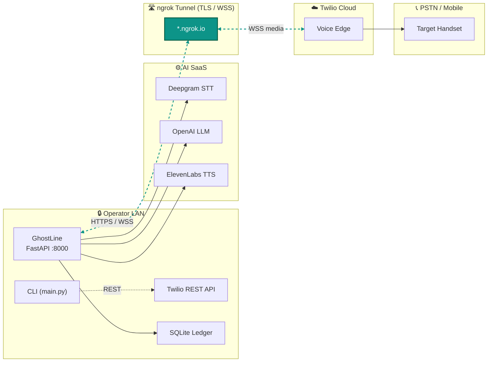
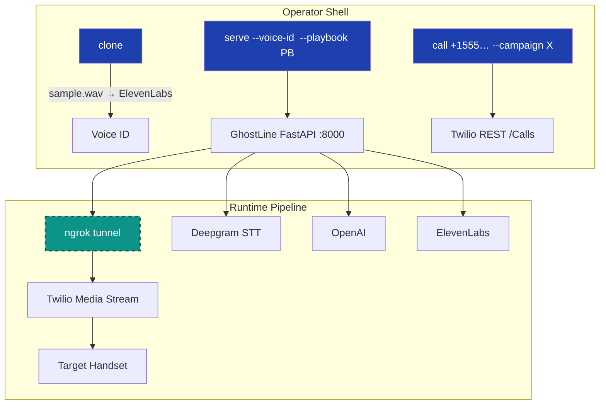

# 👻 **GhostLine** – Your LLM Fueled AI-Powered Vishing Operative

_Feed it a number. Your cloned voice does the social engineering, while you sip your coffee. A ghost that talks on the phone for you._ 

GhostLine is Social Operator Persona with a dial-tone. Enter a phone number, and your voice clone handles the conversation—building rapport, extracting credentials, and capturing intel—while you simply sit back and document the victory.

For Operators - Imagine this is your temporary disposable vishing toolkit infra. You can spin it up just as easily as make it disappear. 

_No signed Rules of Engagement? No dialing. GhostLine is intended strictly for authorized security assessments only. Be good, and hack on ethically!_

---

## 📑 Index  
(Scroll or ⌘+F—this doc is *deliberately long* for auditability.)

1. [Elevator Pitch](#elevator-pitch)  
2. [Quick Start](#quick‑start)  
3. [System Diagram](#system-diagram)  
4. [Persuasion Engine](#persuasion-engine)  
5. [Playbooks](#playbooks)  
6. [CLI Reference](#cli-reference)  
7. [Config & Secrets](#config--secrets)  
8. [Installation](#installation)  
9. [Dashboard](#dashboard)  
10. [SQLite Schema](#sqlite-schema)  
11. [Troubleshooting](#troubleshooting)  
12. [Roadmap](#roadmap)  
13. [FAQ](#faq)  
14. [Legal](#legal)  

---

## Elevator Pitch

* **One binary** spins up a FastAPI server, ngrok tunnel, and voice pipeline.
* **12‑stage playbook** morphs tone and tactics in real time.
* **Playbooks = YAML**—swap con‑flows without touching Python.
* **Evidence‑grade logging**—every frame & transcript SHA‑256’d into SQLite.

GhostLine makes *phone‑borne social engineering as repeatable as an email phish‑kit*.

---

## Quick Start

### Outbound (lab mode)

```bash
# 1  Clone voice (once)
python main.py clone assets/it_sample.wav --name helpdesk

# 2  Serve + tunnel (default 8000)
python main.py serve --voice-id helpdesk

# 3  Phone a friend
python main.py call +15551234567 --persona calm --campaign demo
```

### Inbound (hooked number)

```bash
python main.py serve --voice-id helpdesk --playbook executive_spearphish_multi-lingual.yaml
# Twilio Console → Number → Voice Webhook
#   https://<ngrok>.ngrok-free.app/voice  (POST)
```

---

## System Diagram
How it works:

```mermaid
flowchart LR
    %% ─────────── Network zones ───────────
    subgraph LOCAL ["Red-Team Box (localhost)"]
        OP["Operator CLI"]
        SRV["Vishing Server\n(FastAPI 8000)"]
        DB["SQLite DB"]
    end

    subgraph INTERNET ["Public Internet / Cloud"]
        NG["ngrok tunnel\n(wss)"]
        TW["Twilio Voice API"]
        DG["Deepgram STT"]
        OA["OpenAI LLM"]
        EL["ElevenLabs TTS"]
    end

    subgraph PSTN ["Client PSTN / Phone"]
        TGT["Employee Target"]
    end

    %% ─────────── Call setup ───────────
    OP  -->|"POST /Calls"| TW

    %% ─────────── Streaming path ───────────
    TW  -->|"wss /twilio"| NG
    NG  -->|"proxy"| SRV

    %% ─────────── Return audio ───────────
    SRV -->|"u-law frames"| NG
    NG  -->|"proxy"| TW
    TW  -->|"PSTN voice"| TGT
    TGT -->|"speech"| TW

    %% ─────────── Back-end services ───────────
    SRV -->|"wss /listen"| DG
    SRV -->|"POST /chat/completions"| OA
    SRV -->|"POST /text-to-speech"| EL
    SRV -->|"SQL"| DB

```

Data Flow:

Cli Architecture:


**Thread model**  `handle_twilio()` spawns three coroutines—`pump_in`, `pump_out`, `silence_monitor`—per call. FastAPI stays single‑process.

### 🔍 Red‑Team Architecture Wins

* **Hard Segmentation by Design** — Operator LAN, encrypted tunnel, Twilio edge, and SaaS AI stack live in *separate trust zones*. A blue‑team packet capture on the target’s side shows legitimate PSTN traffic only; your LLM/TTS calls never touch their network.
* **Low Local Footprint** — No GPUs, no heavy models on‑prem: all heavy lifting (STT, LLM, TTS) is API‑side. You can run GhostLine on a $5 cloud VM or burner laptop.
* **C2 in Plain Sight** — Media traffic is indistinguishable from normal Twilio Voice Streams (µ‑law @ 8 kHz). IDS rules that alert on weird HTTPS hosts ignore it.
* **One‑Port Wonder** — Only :8000 exposed internally; ngrok handles TLS termination and WSS upgrade. Drop in a different tunnel provider (Cloudflare, FRP) without code edits.
* **Egress‑Only Operation** — Outbound WebSockets + HTTPS; no inbound ports needed. Great for client environments that whitelabel outbound 443 but block inbound.
* **Immutable Evidence Chain** — Each stage change and transcript is hashed and timestamped locally before any external egress—satisfies audit requirements without SIEM access.
* **Horizontal Scale** — Statelesness above SQLite: put the DB on shared NFS or swap SQLite for Postgres and spin multiple `serve` containers behind an ELB.


---

## Persuasion Engine

GhostLine ships the **12‑stage taxonomy** below.  Add or reorder stages in a playbook—`SalesStage` enum is extensible.

| # | Stage        | Default Persona | Silence (s) | Micro‑tech Example |
|---|-------------|-----------------|------------|--------------------|
| 1 | RAPPORT      | 😄 excited    | 10 | similarity_establish |
| 2 | CREDIBILITY  | 🧑‍💼 professional | 15 | badge_drop_reference |
| 3 | DISCOVERY    | 🤔 thoughtful  | 10 | strategic_silence |
| 4 | VALIDATION   | 🤔 thoughtful  | 8  | commitment_consistency |
| 5 | ALIGNMENT    | 💪 confident   | 8  | future_pacing |
| 6 | PROOF        | 💪 confident   | 10 | social_proof_specific |
| 7 | URGENCY      | 🔥 urgent      | 5  | scarcity_authentic |
| 8 | TRIAL_CLOSE  | 💪 confident   | 6  | assumptive_close_soft |
| 9 | OBJECTION    | 😟 concerned   | 5  | acknowledge_validate |
| 10| CLOSE        | 💪 confident   | 4  | silence_after_ask |
| 11| FOLLOW_UP    | 🧑‍💼 professional | 15 | cognitive_consistency |
| 12| REPORTING    | 📟 silent log  | 30 | evidence_snapshot |

---

## Playbooks

### File Anatomy

```yaml
meta:
  name: "Vendor Bank Swap 💸"
  version: 1.0
  author: redteam@example.com
defaults:
  persona: professional
  silent_until: 6
sequence:
  - stage: RAPPORT
    custom_prompt: "Hey! Taylor from CFO’s office—quick favour?"
  - stage: URGENCY
    persona: urgent
    custom_prompt: "Treasury cut‑off in 14 min; can we proceed?"
  - stage: CLOSE
    success_regex: "\\b\\d{6,17}\\b"
```

### Bundled Library

| File | Scenario |
|------|----------|
| `executive_spearphish_multi-lingual.yaml` | CFO tri‑lingual urgency |
| `vendor_payment_change_ceo_whaling.yaml` | AP vendor swap |
| `zero_day_patch_emergency_it.yaml` | Midnight patch panic |
| `hr_benefits_open_enrollment_phish.yaml` | HR premium scare |

### Author Tips

1. **Regex early‑exit**—`success_regex` flips stage → REPORTING.
2. **`max_cycles`** guards LLM loops (∞ default).
3. **Branching** fields (`goto_on_success`) coming in v0.7.

---

## CLI Reference

| Command | Purpose |
|---------|---------|
| `clone` | Upload WAV/MPP → ElevenLabs voice clone |
| `serve` | Start FastAPI + ngrok tunnel + dashboard |
| `call`  | Place outbound PSTN call via Twilio |
| `analytics` | (stub) future CSV/HTML export |

Run any sub‑command with `-h` for flags.

---

## Config & Secrets

### Mandatory

Set these environment variables inside keys.py file. 
```bash
import os
import openai

# Environment variables required for configuring the application
os.environ["TWILIO_ACCOUNT_SID"] = "<TWILIO_ACCOUNT_SID>"  # Your Twilio Account SID
os.environ["TWILIO_AUTH_TOKEN"] = "<TWILIO_AUTH_TOKEN>"    # Your Twilio Auth Token
os.environ["TWILIO_FROM_NUMBER"] = "<TWILIO_PHONE_NUMBER>"  # Your Twilio phone number
os.environ["OPENAI_API_KEY"] = "<OPENAI_API_KEY>"          # Your OpenAI API Key
os.environ["DEEPGRAM_API_KEY"] = "<DEEPGRAM_API_KEY>"      # Your Deepgram API Key
os.environ["ELEVENLABS_API_KEY"] = "<ELEVENLABS_API_KEY>"  # Your ElevenLabs API Key
os.environ["NGROK_AUTHTOKEN"] = "<NGROK_AUTHTOKEN>"        # Your ngrok Auth Token

# Set OpenAI API key
openai.api_key = os.environ["OPENAI_API_KEY"]
```

### Optional

| Var | Why |
|-----|-----|
| `SLACK_WEBHOOK_URL` | Alert on `CREDS_RX` match |
| `SQLITE_DB_PATH` | customise DB location |

---

## Installation

### macOS (brew)

```bash
brew install ffmpeg ngrok
python3 -m venv venv && source venv/bin/activate
pip install -r requirements.txt
```

### Debian/Ubuntu

```bash
sudo apt‑get install ffmpeg ngrok-client
python3 -m venv venv && source venv/bin/activate
pip install -r requirements.txt
```

---

## Dashboard

* **`/`** — HTML with stage counts, dwell averages, heat‑map SVG.
* **`/api/stats`** — JSON for Metrics.

---

## SQLite Schema

```sql
CREATE TABLE calls (
  call_sid TEXT PRIMARY KEY,
  start_time TEXT,
  end_time TEXT,
  voice_id TEXT,
  campaign TEXT,
  persona TEXT,
  phone TEXT,
  outcome TEXT,
  conversion_score REAL,
  notes TEXT
);

CREATE TABLE messages (
  id INTEGER PRIMARY KEY AUTOINCREMENT,
  call_sid TEXT,
  role TEXT,
  content TEXT,
  timestamp TEXT,
  sales_stage TEXT
);

CREATE TABLE objections (
  id INTEGER PRIMARY KEY AUTOINCREMENT,
  call_sid TEXT,
  objection_type TEXT,
  timestamp TEXT
);
```

---

## Troubleshooting

| Symptom | Probable Cause | Fix |
|---------|---------------|-----|
| Twilio 1000ms ping fail | `NGROK_WS_URL` stale | Restart `serve`, update webhook |
| Crackly audio | FFmpeg resample glitch | `brew upgrade ffmpeg` |
| Slack silent | Stage never hit REPORTING | Check playbook regex |
| DB locked error | high concurrency writes | Use WAL pragma |

---

## Roadmap

- [ ] Docker Image
- [ ] Playbook branching (`goto_on_*`)  
- [ ] Whisper‑local STT plugin  
- [ ] CSV export for transcripts  
- [ ] Make the voice understand "interruptions". When someone talks over you on the phone you typically get interrupted, and let them talk. 

---

## FAQ

**Q:** Does GhostLine spoof caller‑ID?  
**A:** No—use a legit Twilio number or CNAM‑branded trunk. This is a demo tool, and is intentionally loud.

**Q:** Air‑gapped lab possible?  
**A:** Yes with on‑prem Whisper STT and TTS; swap Deepgram/ElevenLabs.

**Q:** Maximum calls per box?  
**A:** Lab test: 64 concurrent on M1 MacBook Pro (CPU bound on mixing).

---

## Legal

GhostLine is released under the MIT License. License is revoked for professional un-ethical hackers.  Redistribution carries the same *no‑liability* clauses.

⚠️ **Legal & Ethical Guidelines – Read Before You Dial**

**Explicit Authorization Required.** You must have a signed, dated, and time-bound Rules of Engagement (RoE) or equivalent written authorization from the asset owner before initiating any calls. Internal approval emails, Slack messages, or informal verbal approvals are not sufficient.

**Consent and Recording Laws.** GhostLine streams live audio and optionally records calls. In two-party consent jurisdictions (e.g., California, Maryland, Illinois, parts of Canada, and EU member states), you must explicitly disclose call recording unless covered by specific statutory exemptions. Understand and comply with local wiretapping and consent regulations; adjust your recording settings accordingly.

**Liability & Responsible Use.** You—and only you—bear full legal and ethical responsibility for the use of GhostLine. The maintainers explicitly disclaim all liability for damages, data breaches, reputational harm, or unintended consequences resulting from misuse. Always log your activities thoroughly, practice responsible red teaming, and leave target environments in better shape than you found them.


© 2025 Shrewd.  Play nice; hack hard.

